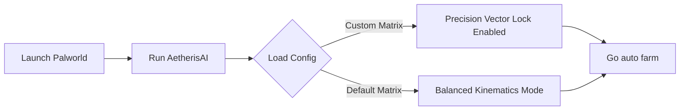

# 🌟 AetherisAI — Palworld Auto Farm &  Radar / 

---

  </a>
---

  <!-- Кликабельные кнопки (Оранжевый индустриальный стиль) -->
  
  

## ⚙️ Workflow Diagram

---

# 🌟 Core Modules & Capabilities

🥚 Incubator & Breeding Automation

Instant Hatch Hooking: Overrides incubator countdown timers and environmental warmth/cooling parameters directly via PalIncubator object arrays.

✨ Spatial Telemetry & Radar Array

500m Target Scanner: High-refresh 2D radar mapping active trajectory points for Lucky/Shiny Pals, Legendary Bosses (e.g., Jetragon, Frostallion), and Palpagos Island dungeon entrances.

💎 Resource & Inventory Management

Gravity Drop Magnet: Pulls dropped Paldium, Coal, and Ore instances directly to player coordinates (APalPlayerCharacter).

Weight Capacity Adjuster: Calibrates local weight limits for heavy resource transportation and base expansion.

⚡ Base Camp & Pal Sanity Monitor

SAN & Productivity Sync: Restores assigned base Pal Sanity and work speed multipliers to optimize automated crafting.

---

## Non-Invasive Safety & Zero-Ban Architecture

* **`[ZERO PROCESS INTERACTION]`** — The software relies exclusively on Windows Desktop API pixel capture. It does not open game handles, read runtime memory lines, or hook execution engine functions.
* **`[ANTI-HEURISTIC PASSIVE]`** — Completely bypasses client-side telemetry systems. Because no code is injected into the application environment, the software cannot be detected by traditional system signature scanners.
* **`[LOCAL HARDWARE COMPILATION]`** — The neural network trains, loads, and operates strictly on your local GPU (CUDA/DirectX), keeping your usage data private and completely decentralized.
* **`[OPTIMIZED YOLO FRAMEWORK]`** — Employs custom micro-architectures that deliver lightning-fast inference times (<2ms) without reducing your active in-game frame rate (FPS).
---

`palworld`, `palworld-sdk`, `yolov8`, `automation`, `automation-framework`, `real-time-processing`, `computer-vision`, `object-detection` , `palworld-radar`  `palworld-breeding`  `palworld-mods` `palworld-pals` `palworld-grind`

<!-- update: B -->